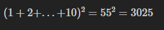
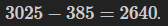

# Problem 6
## Sum square difference

The sum of the squares of the first ten natural numbers is,

The square of the sum of the first ten natural numbers is,

Hence the difference between the sum of the squares of the first ten natural numbers and the square of the sum is .

Find the difference between the sum of the squares of the first one hundred natural numbers and the square of the sum.